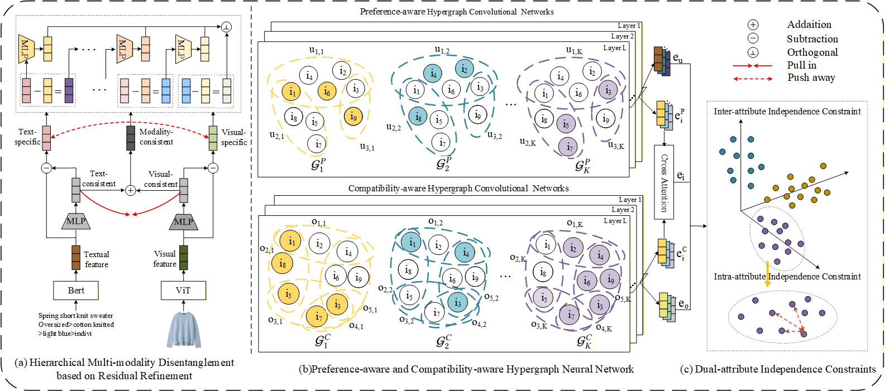

# PCM_SPSAD
```
If you have any questions, please feel free to issue or contact me by email. 

## Overview
Personalized compatibility modeling aims to provide users with complementary items (e.g., top, bottom) that are both personalized and compatible with a given item or outfit. While existing approaches have made significant progress in disentanglement-based compatibility modeling, they still suffer from two key limitations: the disentanglement process often fails to preserve original semantics, and the inadequate modeling of attribute independence. To address this, we propose a framework named Personalized Compatibility Modeling with Semantics Preserving Sequential Attribute Disentanglement (PCM-SPSAD), which can disentangle attributes while preserving semantics and enhance representations through dual-independence constraints. Specifically, we design a hierarchical multi-modality disentanglement approach, which avoids redundancy between modalities through coarse-grained disentanglement, and then recursively disentangles fine-grained attributes from the residuals of modality representations. Furthermore, we enforce dual-attribute independence constraints to separately promote inter-attribute and intra-attribute independence from space and statistical perspectives. Extensive experiments on three real-world datasets demonstrate that our method outperforms state-of-the-art baselines in personalized recommendation and retrieval tasks.




## Running
```
python3 run.py --dataset IQON
python3 run.py --dataset POLYVORE
python3 run.py --dataset ALIBABA
```


## License
```

Permission is hereby granted, free of charge, to any person obtaining a copy
of this software and associated documentation files (the "Software"), to deal
in the Software without restriction, including without limitation the rights
to use, copy, modify, merge, publish, distribute, sublicense, and/or sell
copies of the Software, and to permit persons to whom the Software is
furnished to do so, subject to the following conditions:

The above copyright notice and this permission notice shall be included in all
copies or substantial portions of the Software.

THE SOFTWARE IS PROVIDED "AS IS", WITHOUT WARRANTY OF ANY KIND, EXPRESS OR
IMPLIED, INCLUDING BUT NOT LIMITED TO THE WARRANTIES OF MERCHANTABILITY,
FITNESS FOR A PARTICULAR PURPOSE AND NONINFRINGEMENT. IN NO EVENT SHALL THE
AUTHORS OR COPYRIGHT HOLDERS BE LIABLE FOR ANY CLAIM, DAMAGES OR OTHER
LIABILITY, WHETHER IN AN ACTION OF CONTRACT, TORT OR OTHERWISE, ARISING FROM,
OUT OF OR IN CONNECTION WITH THE SOFTWARE OR THE USE OR OTHER DEALINGS IN THE
SOFTWARE.
```

